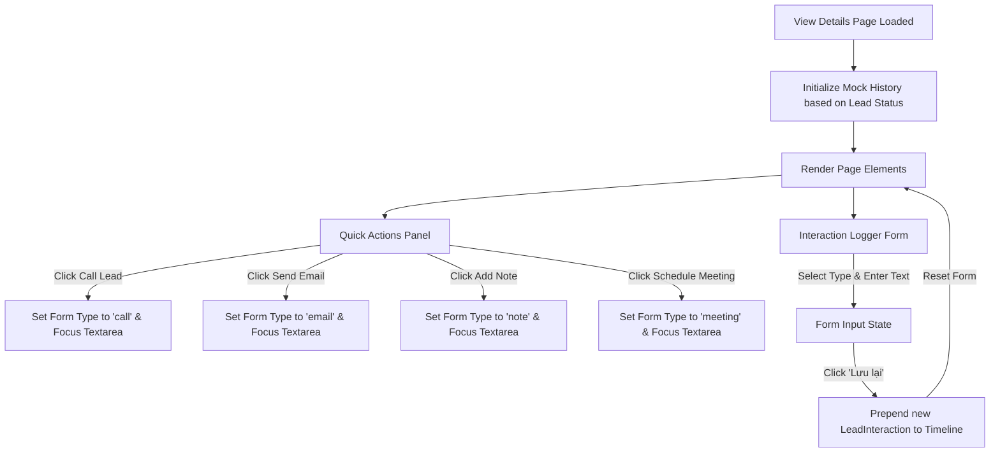

# Technical Specification: Lead Details Interactive View (History, Notes & Quick Actions)

This document provides a comprehensive, production-grade specification for making the Lead Details page (`/leads/[id]`) fully interactive. It details the state machine, form operations, visual layout, and integrations of the **Quick Actions** sidebar.

---

## 1. Interaction Flow & State Machine Diagram



---

## 2. Comprehensive Visual & Functional Specifications

### 2.1 Timeline & Notes Card (Main Content Area)
The logging form and activity timeline will be unified inside a clean Card component under the profile card in the main column (`lg:col-span-2`).

- **Logging Form UI Elements:**
  - **Type Selector (Tabs):** Horizontal button group with visual indicators (Icon + Label).
    - Call: Blue (`bg-blue-50 text-blue-600 border-blue-200`)
    - Email: Green (`bg-emerald-50 text-emerald-600 border-emerald-200`)
    - Meeting: Orange (`bg-orange-50 text-orange-600 border-orange-200`)
    - Note: Purple (`bg-purple-50 text-purple-600 border-purple-200`)
  - **Textarea:** Flexible textarea with a placeholder changing dynamically depending on selected type (e.g. "Nhập tóm tắt cuộc gọi...", "Nhập ghi chú...").
  - **Save Button:** High-visibility Indigo button with a loading micro-animation upon saving.

- **Timeline UI Elements:**
  - **Timeline Path:** Dotted/solid gray vertical line (`w-0.5 bg-slate-100 left-6 top-8 bottom-0 absolute`).
  - **Timeline Entry Card:** Every interaction lists:
    - **Header:** Actor's name (e.g., Assigned Sales Rep) and timestamp.
    - **Body:** Content details formatted in readable text blocks.
    - **Tag:** Mini status pill matching the type's color scheme.

---

### 2.2 Quick Actions Panel (Sidebar)
All items in the **Quick Actions** sidebar will be wired directly to the timeline state:

1. **Call Lead:**
   - Swaps the Logging Form's selected type to **Call**.
   - Automatically scrolls the viewport to the Logging Form.
   - Focuses the input textarea.
2. **Send Email:**
   - Swaps the Logging Form's selected type to **Email**.
   - Scrolls to and focuses the Logging Form textarea.
3. **Add Note:**
   - Swaps the Logging Form's selected type to **Note**.
   - Scrolls to and focuses the Logging Form textarea.
4. **Schedule Meeting:**
   - Swaps the Logging Form's selected type to **Meeting**.
   - Scrolls to and focuses the Logging Form textarea.

---

### 2.3 Edit & Delete Header Controls
1. **Edit Lead:**
   - Triggers a Modal displaying `<LeadForm lead={lead} />` (matching the edit functionality on the main `/leads` page).
2. **Delete Lead:**
   - Shows a native browser confirmation dialog. If confirmed, deletes the lead (simulated) and redirects back to `/leads`.

---

## 3. Technical Implementation & Code Changes

### 3.1 Types Schema Update (`types/index.ts`)
We will append the interaction log interface schema:
```typescript
export interface LeadInteraction {
  id: string;
  type: "call" | "email" | "meeting" | "note";
  title: string;
  content: string;
  createdAt: string;
  createdBy: string;
}
```

### 3.2 Lead Details Component Update (`app/(dashboard)/leads/[id]/page.tsx`)
We will refactor the page component to include the following state management:

```tsx
// Key React Hooks & Refs
const [interactions, setInteractions] = useState<LeadInteraction[]>([]);
const [logType, setLogType] = useState<"call" | "email" | "meeting" | "note">("note");
const [logContent, setLogContent] = useState("");
const [isEditModalOpen, setIsEditModalOpen] = useState(false);
const textareaRef = useRef<HTMLTextAreaElement>(null);
const formRef = useRef<HTMLDivElement>(null);

// Action triggers to focus and switch logger type
const triggerAction = (type: "call" | "email" | "meeting" | "note") => {
  setLogType(type);
  formRef.current?.scrollIntoView({ behavior: "smooth" });
  setTimeout(() => textareaRef.current?.focus(), 300);
};
```

---

## 4. Verification & Validation Steps

### 4.1 UI Consistency Checklist
- Ensure form and buttons are fully responsive on mobile layout (the sidebar drops below the main content).
- Verification command: `npx tsc --noEmit` must return code `0`.

### 4.2 End-to-End Walkthrough Scenarios
1. **Quick Action Triggering:** Click **Call Lead** in the right sidebar. Verify that the browser scrolls to the Logging Form, the type switches to "Call" (blue highlight), and the cursor is focused in the text area.
2. **Log Submission:** Type *"Đã liên hệ nhưng khách bận, hẹn gọi lại lúc 3h chiều"* and click **Lưu lại**. Verify that the new item is prepended to the top of the timeline with a phone icon, a blue Call badge, and a timestamp.
3. **Edit Interaction:** Click **Edit** in the top-right header. Verify that the Edit Lead modal opens, allowing updating the lead's name or status.
4. **Delete Interaction:** Click **Delete** in the top-right header, confirm the dialog, and verify it redirects smoothly back to `/leads`.
